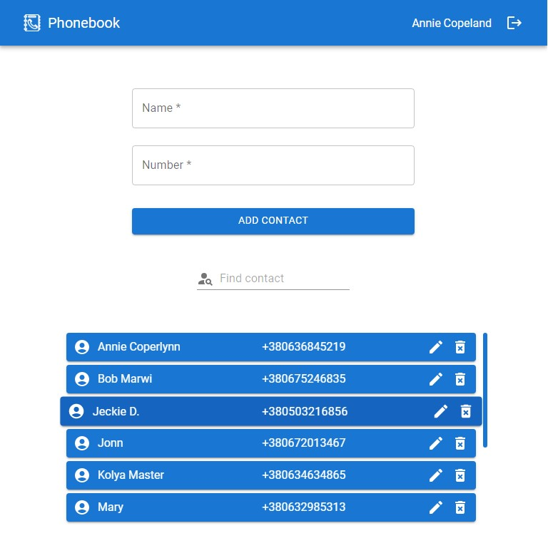

# Phonebook

With the help of this website, you can create and save your contact database.
User authorization is implemented in the application. You can create new
contacts, edit them and delete them. Protection against accidental deletion of
contacts is provided. The project was created using Create React App.

This APP uses its own
[REST API](https://github.com/Andrii-Posternak/REST-API-phonebook)

## Created with

:white_check_mark: React  
:white_check_mark: REST API  
:white_check_mark: Webpack  
:white_check_mark: HTML  
:white_check_mark: Styled Components  
:white_check_mark: Material UI

## Usage

To start the application, you need to open it in a web browser at
[link](https://andrii-posternak.github.io/phonebook/).

- Register on the site if you are a new user.
- Log in with your account if you are already registered.
- Enter the name and phone number in the appropriate fields and click the add
  contact button.
- To edit a contact, click the appropriate button next to it. In the modal
  window that opens, enter new data and press the confirmation button.
- To delete a contact, click the corresponding button next to it. In the modal
  window that opens, press the confirmation button.
